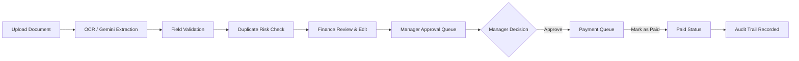
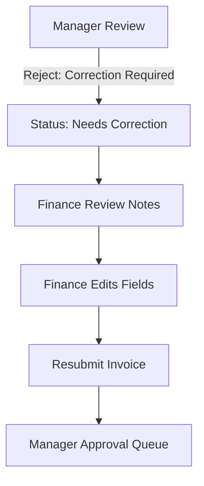
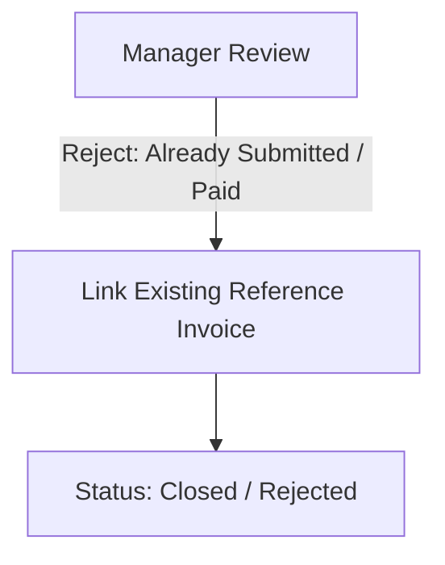
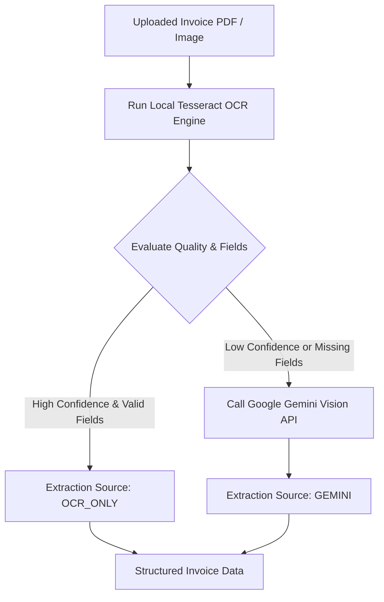
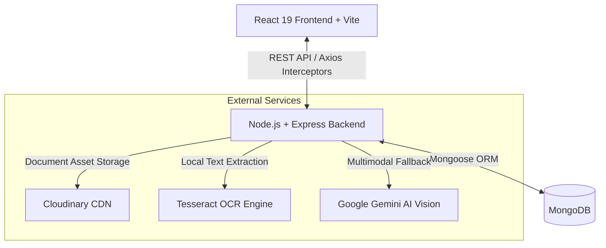

# InvoiceFlow

## What is InvoiceFlow?

InvoiceFlow is an Accounts Payable automation platform that extracts invoice data using OCR/AI, detects duplicates, and routes invoices through Finance → Manager approval. After approval, it tracks invoices through Payment Queue → Paid → Audit Trail.

---

## Problem Statement

Manual accounts payable operations often face key operational bottlenecks:

- **Time-Consuming Data Entry**: Manual typing of vendor names, line items, amounts, and dates from paper or PDF invoices.
- **Extraction Errors**: Human mistakes in keying numbers, dates, or tax breakdowns.
- **Duplicate Submissions**: Accidental re-submission of identical bills leading to risk of overpayment.
- **Approval Delays**: Invoices getting stuck in email threads without clear visibility into pending reviews.
- **Poor Payment Tracking**: Lack of a centralized audit trail showing who approved, modified, or marked invoices as paid.

---

## Solution

InvoiceFlow addresses these challenges with an end-to-end digital workflow:

- **OCR-First Data Extraction**: Automatically parses uploaded documents using local Tesseract OCR.
- **Gemini AI Fallback**: Seamlessly uses Google Gemini Multimodal Vision API when OCR confidence is low or mandatory fields are unparsed.
- **Field Validation**: Computes missing mandatory or optional fields before submission.
- **Duplicate Risk Detection**: Cross-checks incoming invoices against MongoDB database records using normalized vendor names, invoice numbers, and amounts.
- **Finance → Manager Workflow**: Establishes strict Role-Based Access Control (RBAC) separating upload/edit permissions from approval authorization.
- **Correction & Resubmit**: Allows managers to request changes with structured notes, enabling Finance to fix and resubmit without re-uploading documents.
- **Payment Queue**: Manages approved bills in a dedicated confirmation queue before marking them as Paid.
- **Complete Audit Trail**: Records immutable timestamps, user actions, revision history, and status changes.

---

## Key Features

- **Hybrid OCR & AI Extraction Pipeline**: Tesseract OCR for fast local processing with Google Gemini Vision fallback for complex layouts.
- **Multi-Stage Duplicate Risk Detection**: Normalized string matching identifying exact duplicates (`DUPLICATE`) and amount discrepancies (`POTENTIAL_DUPLICATE`).
- **Role-Based Access Control (RBAC)**: Dedicated interfaces and route guards for Finance Executives and Managers.
- **Side-by-Side Document Inspection**: Document viewer displaying the original PDF/Image alongside extracted line items and fields.
- **Structured Rejection & Correction System**: Modal-driven rejection workflows supporting correction requests and reference linking to already-submitted/already-paid bills.
- **Payment Execution Queue**: Confirmation workspace for Finance Executives to review approved invoices and record payment completion.
- **Interactive Financial Dashboard**: Analytics visuals including spend distribution curves, category breakdowns, and audit timelines.
- **Global Context Search**: Palette searching invoices by vendor name, invoice number, status, or total amount.
- **Real-Time Notification Center**: Drawer providing status updates with single-click auto-dismiss functionality.

---

## Invoice Processing Flow

### Standard Approval & Payment Pipeline



### Rejection & Correction Flow



### Closed Duplicate / Already Paid Flow



---

## AI & OCR Architecture

InvoiceFlow uses an **OCR-First Hybrid Architecture**:



- Running Tesseract OCR first handles clear, high-quality invoices locally.
- Google Gemini Multimodal Vision API is invoked only when OCR confidence falls below threshold or critical fields are missing.
- This hybrid strategy significantly reduces external API consumption and latency while keeping extraction reliability high.

---

## Duplicate Detection

Duplicate detection operates as an advisory risk engine before and during invoice submission:

```
1. Normalization:
   Vendor Name & Invoice Number → lowercase, trim whitespace, strip symbols/punctuation.

2. Primary Match:
   Match: Normalized Vendor + Normalized Invoice Number + Total Amount
   Result: DUPLICATE (Strict Match)

3. Secondary Match:
   Match: Normalized Vendor + Normalized Invoice Number (Amount differs)
   Result: POTENTIAL_DUPLICATE (Warning)
```

> **Note**: Duplicate detection acts as a risk signal for human review and does not automatically reject invoices.

---

## User Roles

### Finance Executive
- Upload PDF and image invoices.
- Inspect and edit AI/OCR extracted vendor details, line items, and totals.
- Submit verified invoices to the Manager Approval Queue.
- Review manager rejection remarks, fix highlighted fields, and resubmit.
- Manage the Payment Queue and mark approved invoices as Paid after external bank disbursement.

### Manager
- Review incoming approval queue items with side-by-side document previews.
- Approve invoices (moving them to the Payment Queue).
- Reject invoices with structured reasons (`CORRECTION_REQUIRED`, `ALREADY_SUBMITTED`, `ALREADY_PAID`).
- Link duplicate or previously paid submissions to their original database records.
- Monitor finance metrics and team activity logs.

---

## System Architecture



---

## Tech Stack

- **Frontend**: React 19, Vite, Tailwind CSS, Lucide React, Axios
- **Backend**: Node.js, Express.js, JSON Web Tokens (JWT), Express Validator
- **Database**: MongoDB, Mongoose ORM
- **AI & Processing**: Tesseract OCR (`tesseract.js`), Google Gemini Multimodal Vision (`@google/genai`)
- **Cloud Storage**: Cloudinary CDN

---

## Screenshots

<!-- Insert Screenshot 1: Landing Page -->
<!--  -->

<!-- Insert Screenshot 2: Finance Dashboard -->
<!--  -->

<!-- Insert Screenshot 3: Invoice Upload & Extraction -->
<!--  -->

<!-- Insert Screenshot 4: Invoice Details & Side-by-Side Review -->
<!--  -->

<!-- Insert Screenshot 5: Manager Approval Queue -->
<!--  -->

<!-- Insert Screenshot 6: Payment Queue -->
<!--  -->

<!-- Insert Screenshot 7: Finance Team View -->
<!--  -->

<!-- Insert Screenshot 8: Audit Trail & History -->
<!--  -->

---

## Installation

### Prerequisites
- **Node.js**: v18.x or higher
- **MongoDB**: Local instance or MongoDB Atlas URI

### Setup Instructions

1. **Clone Repository**
   ```bash
   git clone https://github.com/Jeelkathiria/invoiceflow.git
   cd invoiceflow
   ```

2. **Backend Setup**
   ```bash
   cd backend
   npm install
   ```

3. **Frontend Setup**
   ```bash
   # In project root
   npm install
   ```

4. **Environment Configuration**
   - Create `backend/.env` (see Environment Variables section below).
   - Create `.env` in the root directory.

5. **Run Development Servers**
   - Start Backend:
     ```bash
     cd backend
     npm run server
     ```
   - Start Frontend (in root):
     ```bash
     npm run dev
     ```

---

## Environment Variables

### Backend Configuration (`backend/.env`)

```env
PORT=5001
MONGO_URI=mongodb://localhost:27017/invoiceflow
JWT_SECRET=your_jwt_secret_key_here
GEMINI_API_KEY=your_google_gemini_api_key_here
CLOUDINARY_CLOUD_NAME=your_cloudinary_cloud_name
CLOUDINARY_API_KEY=your_cloudinary_api_key
CLOUDINARY_API_SECRET=your_cloudinary_api_secret
NODE_ENV=development
```

### Frontend Configuration (`.env`)

```env
VITE_API_URL=http://localhost:5001/api
```

---

## Project Structure

```
InvoiceFlow/
├── backend/
│   ├── src/
│   │   ├── config/          # DB & Cloudinary configuration
│   │   ├── controllers/     # Route controller logic
│   │   ├── middleware/      # Auth, role, file upload & validation middleware
│   │   ├── models/          # Mongoose models (Invoice, User, Notification, etc.)
│   │   ├── routes/          # Express route definitions
│   │   ├── services/        # Business logic (Gemini, OCR, Invoice, Approval)
│   │   ├── utils/           # Duplicate checker & OCR text parser utilities
│   │   └── validators/      # Request validation schemas
│   ├── app.js
│   ├── server.js
│   └── package.json
├── src/
│   ├── assets/              # Static media assets
│   ├── components/
│   │   ├── common/          # Search modal, notifications, logo
│   │   ├── dashboard/       # Sidebar, TopNavbar, Analytics, Tables
│   │   ├── invoice/         # Approve & Reject modal components
│   │   └── landing/         # Landing page section components
│   ├── context/             # React AuthContext
│   ├── layouts/             # Main dashboard layout wrapper
│   ├── pages/               # Page views (Dashboard, InvoiceDetails, Upload, Queue, etc.)
│   ├── routes/              # Protected & Role-based routes
│   ├── services/            # Axios API instances & service helpers
│   ├── utils/               # Formatting & helper functions
│   ├── App.jsx
│   ├── index.css
│   └── main.jsx
├── index.html
├── package.json
├── tailwind.config.js
└── vite.config.js
```

---

## Future Improvements

- Automated banking gateway / webhook integration for direct payout execution.
- Advanced vendor analytics and spending anomaly alerts.
- Fuzzy match similarity algorithms for highly distorted vendor names.

---

## Author

**Jeel Katheria**  
GitHub: [https://github.com/Jeelkathiria](https://github.com/Jeelkathiria)
